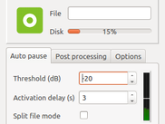
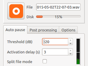
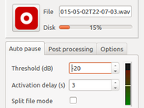

# Description

QJackRcd is a simple stereo recorder for Jack with few features as silence processing for automatic pause, file splitting, background file post-processing.
It can be used with QJackCtl.

# Features

* QT simple GUI with disk usage and vumeter
* Jack support for recording, jack transport support
* Silence compressing with auto pause and optional file splitting
* Background WAV post processing for format conversion and signal processing
* Automatic connection with first launched jack source, store/restore jack connections facility
* CLI mode for automation

Docxygen view [Doxygen code](html/index.html)
